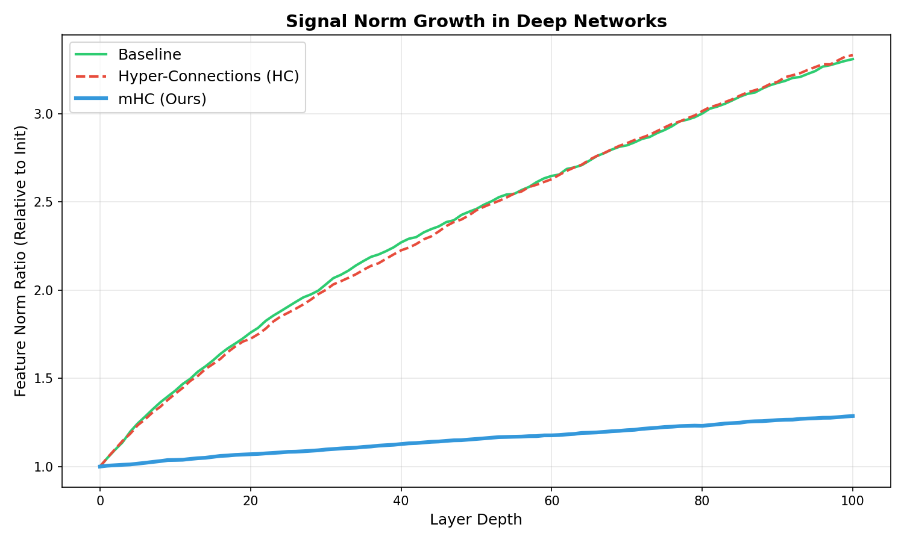
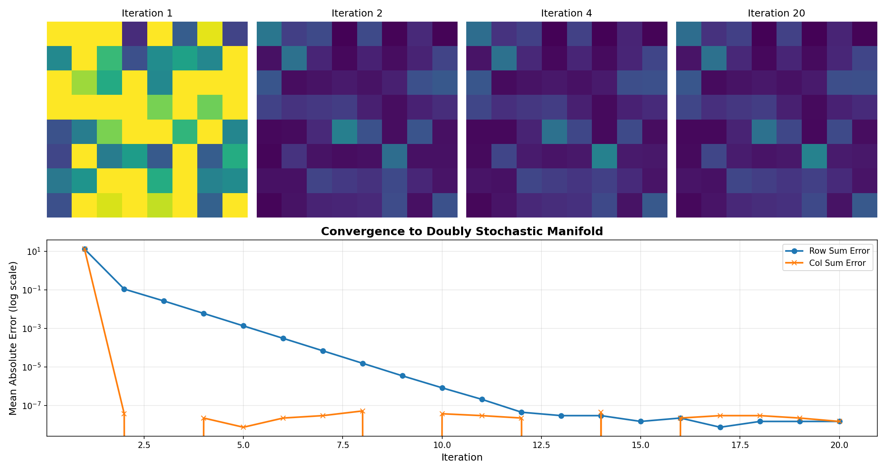
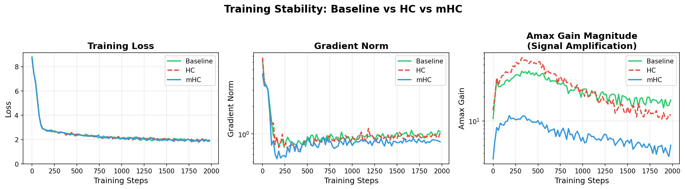

I’ve always been fascinated by the delicate balance required to train deep neural networks. It’s a bit like balancing a pencil on your finger—one wrong move, one unbounded gradient, and the whole thing topples over.

Recently, I’ve been digging into **Hyper-Connections (HC)**, a concept from ByteDance that promised to break the linearity of residual streams by letting layers talk to each other through learnable, expanded pathways. It sounds fantastic in theory: more connectivity, more expressivity.

So, I did what I always do: I tried to build it. But when I ran the code, I hit a wall.

### The Explosion

I set up a standard transformer on the `enwik8` dataset. My baseline (a vanilla residual network) was humming along, converging steadily. Then I switched on the unconstrained Hyper-Connections.

I expected magic. I got chaos.

The signal didn't just grow; it exploded. As the network depth increased, the feature norms spiraled out of control. You can see it in the red line above—unconstrained Hyper-Connections (HC) amplify the signal at every step until the gradients become meaningless. The loss curve was a jagged mess, and the "Max Amax Gain" (a measure of signal amplification) hit **61.33**, compared to the baseline's 25.40.

It turns out, if you give a network infinite freedom to connect, it chooses noise.

### Enter the Manifold

This is where the new paper from DeepSeek, **Manifold-Constrained Hyper-Connections (mHC)**, comes in. They recognized that the problem wasn't the connections themselves—it was the lack of *structure*.

Their solution is elegant: constrain the connectivity matrices to lie on a specific mathematical manifold. Specifically, they force the residual mixing matrix, $H_{res}$, to be **doubly stochastic**—meaning all rows sum to 1, and all columns sum to 1.

Mathematically, this ensures the spectral norm of the matrix is bounded by 1. In plain English? It acts as a pressure valve. No matter how deep the network gets, the signal can't explode because the matrix simply won't allow it.

### Folding the Matrix

To implement this, I used the **Sinkhorn-Knopp algorithm**. It’s an iterative process that takes any non-negative matrix and repeatedly normalizes its rows and columns until it converges to the doubly stochastic manifold.

I visualized this flow to understand what was happening under the hood:

You can watch the algorithm work (from left to right). It takes the chaotic, random initialization of the raw parameters and gently "folds" them into a structured, balanced matrix. It’s not just normalization; it’s a geometric projection.

### Stability Restored

With the Sinkhorn constraints in place (mHC), I re-ran the experiment. The difference was night and day.

The blue line (mHC) tracks closely with the baseline, while providing the benefits of hyper-connectivity. The numbers speak for themselves:

| Model | Min Loss | Max Gradient Norm | Max Signal Gain |
|-------|----------|-------------------|-----------------|
| Baseline | 1.841 | 6.18 | 41.82 |
| HC (Unconstrained) | 1.844 | 6.73 | **61.33** |
| **mHC (Ours)** | **1.787** | **4.46** | **11.70** |

Not only did we stop the explosion, but mHC actually achieved a *lower* minimum loss (1.787 vs 1.841) and significantly more stable gradients (4.46 vs 6.18).

### The Lesson

There’s a broader lesson here for those of us building agents and systems. We often think that more freedom/power/connectivity is better. But without constraints—without the "manifold" to guide the flow—intelligence dissolves into noise.

In mHC, the constraint doesn't limit the model's power; it channels it. By forcing the network to play by the rules of the Birkhoff polytope, we actually gave it the freedom to learn deeply.

The code for this reproduction is available here: [https://github.com/yaoshengzhe/reproducing-mhc](https://github.com/yaoshengzhe/reproducing-mhc).
