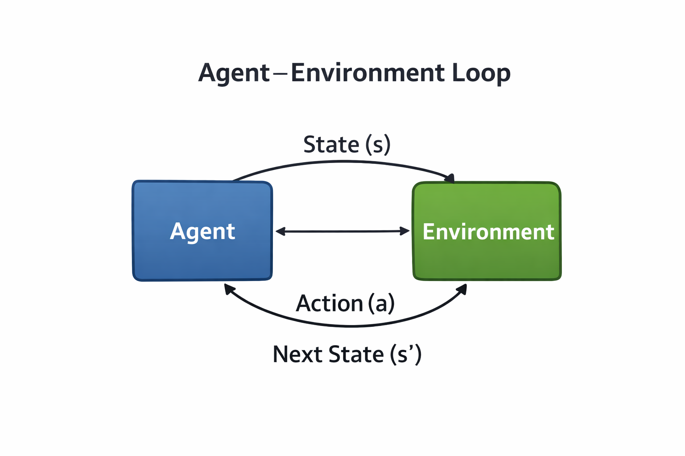
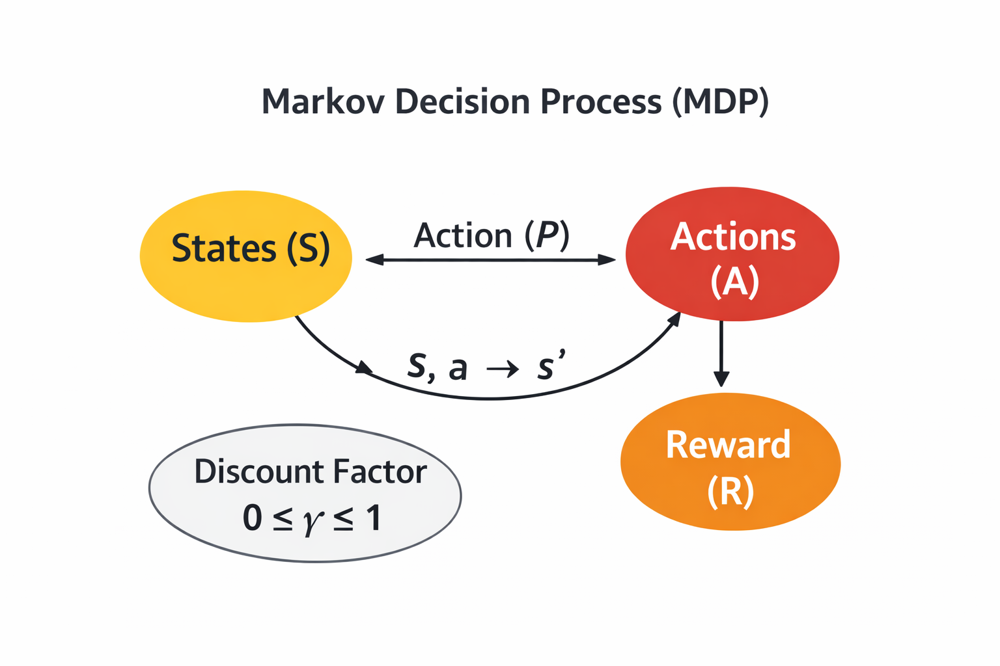
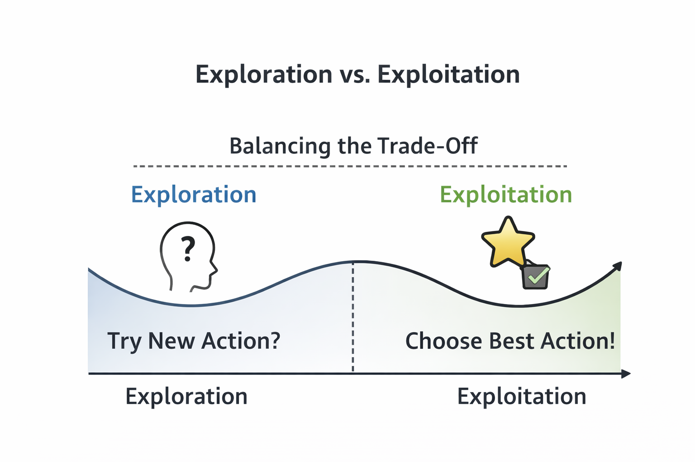
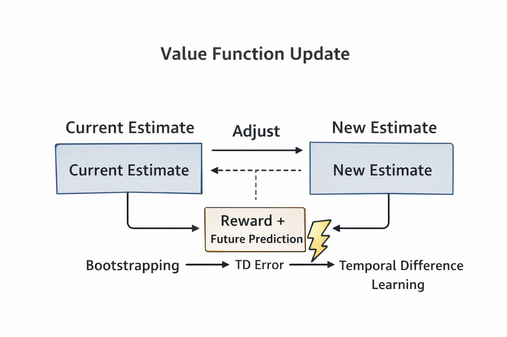
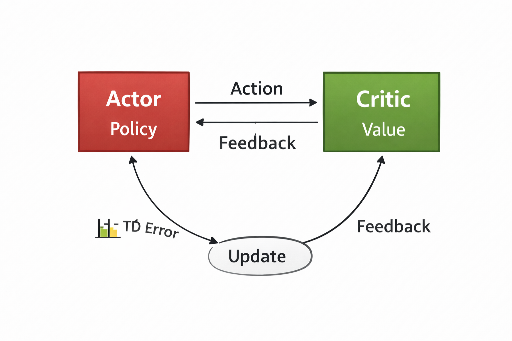
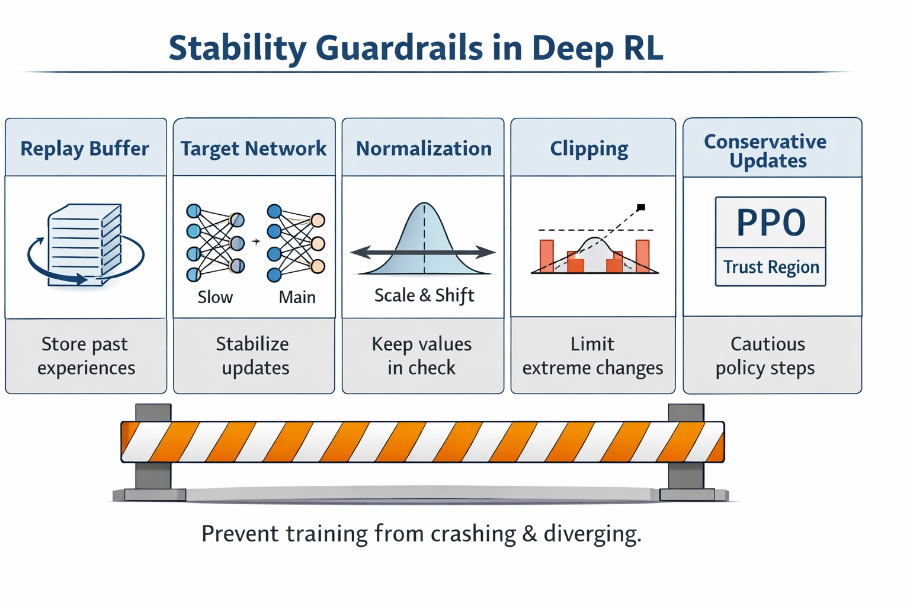

Reinforcement learning has an uncanny ability to make simple ideas feel complicated.

In supervised learning, the world tells you when you’re wrong. In RL, the world often lies:
you can take the right action and still get punished (delayed reward), and take the wrong action and get lucky (stochasticity).

That mismatch—between *what you did* and *what you immediately observe*—is the reason RL feels abstract, fragile, and full of “tricks.”

That’s why **[EasyRL](https://datawhalechina.github.io/easy-rl/#/)** (a.k.a. *蘑菇书*, “the Mushroom Book”) stands out. It doesn’t try to earn credibility by drowning you in notation. It earns trust by giving you **mental models that survive contact with real training runs**.

**TL;DR**
- RL is decision-making under delayed, noisy feedback—not “supervised learning with rewards.”
- Exploration is uncertainty management—not randomness.
- Most deep RL progress is about stability—guardrails that keep learning from blowing up.

## Reinforcement Learning as Decision-Making Under Bad Feedback

At a high level, RL is learning from consequences: act, observe, update.

But the crucial detail is *what’s missing*:
- no correct labels
- no immediate feedback
- no guarantee that short-term outcomes reflect long-term quality

*Figure 1. The RL loop: the agent interacts with the environment and learns from delayed, imperfect signals.*

Once you see RL as **decision-making under delayed and imperfect feedback**, common frustrations stop feeling mysterious:
- rewards arrive late
- good actions can look bad in the short term
- bad actions can get lucky
- learning signals are noisy and unstable

To reason about that mess, RL leans on one clean abstraction.

## The MDP: The Contract Behind (Almost) All RL

At the heart of RL is the **Markov Decision Process (MDP)**—a contract between the agent and the world: *what the agent can observe, what it can do, and how the world responds.*

*Figure 2. The MDP formalizes RL with states (S), actions (A), transition dynamics (P), rewards (R), and a discount factor (γ).*

This framing quietly does a lot of work:
- It separates what the agent **controls** (actions, policy) from what it **doesn’t** (environment dynamics).
- It explains why the future matters (you optimize *return*, not single-step reward).
- It makes credit assignment feel inevitable: *which earlier action caused this later outcome?*

Once you internalize the MDP contract, most RL algorithms feel like different coping strategies for the same underlying challenge.

## Exploration Is Uncertainty Management (Not Randomness)

A lot of intros treat exploration as a hack: add noise, flip a coin, hope you don’t get stuck.

EasyRL pushes a better mental model: exploration is about **reducing uncertainty** so future decisions get better.

*Figure 3. Exploration buys information; exploitation cashes it in.*

Seen this way, several things fall into place:
- greedy strategies fail early because early estimates are wrong
- epsilon-greedy is simple but crude (it ignores *what* you’re uncertain about)
- stochastic policies, entropy bonuses, and optimism show up because they encode a stance toward uncertainty

Exploration stops being “a hyperparameter you tune” and becomes “a design choice you can argue about.”

## Value Functions Are Predictions, Not Truth

Value functions often arrive as intimidating recursive equations. The book demystifies them by saying the quiet part out loud:

A value estimate is a **prediction about future return**.

That means it is:
- a guess
- a continuously updated guess
- a guess that will be wrong—especially early

*Figure 4. Value learning updates predictions using reward, bootstrapping, and temporal-difference error.*

With “value as prediction,” a bunch of “RL weirdness” becomes normal:
- bootstrapping is using your current prediction to improve the next one
- overestimation bias is what happens when your guesses become systematically optimistic
- instability is expected when predictions feed back into learning

Instead of memorizing equations, you start asking the useful question:
**When will this estimate lie to me?**

## Policy Learning Is About Behavior (Intent), Not Just Scores

Value-based methods ask: *How good is this action?*

Policy-based methods ask: *What kind of behavior should this agent produce?*

That shift matters. It changes how you think about learning:
- value-based methods feel like building a scoring function
- policy-based methods feel like shaping behavior under uncertainty

*Figure 5. Actor–critic as a feedback loop between intent (actor) and judgment (critic).*

This framing makes actor–critic methods intuitive:
- the actor represents intent (behavior)
- the critic represents judgment (evaluation)
- learning becomes a loop, not a lookup table

It also sets you up to understand why “modern RL successes” are often more about *training dynamics* than clever objectives.

## Stability Is the Real Breakthrough

One of the most honest lessons in EasyRL is also the most practical:

**Reinforcement learning fails easily.**

Training diverges. Policies collapse. Value estimates explode. And deep function approximation makes all of this easier to trigger.

*Figure 6. Many deep RL “breakthroughs” are guardrails that prevent training from crashing.*

Replay buffers, target networks, normalization, clipping, and conservative updates (e.g., PPO-style constraints) aren’t “fancy tricks.” They’re safety rails.

A mental model I wish more intros stated explicitly:

> RL works when instability is controlled just enough for improvement to accumulate.

## Who This Book Is For (and How I’ve Read It)

If you’ve bounced off RL because it felt like a pile of symbols and special cases, this book is a good reset.

How I’d approach it:
1. **Read for mental models first** (MDP, exploration, prediction, stability).
2. Then **implement one tiny algorithm** (tabular TD, Q-learning, or a minimal policy gradient) to make the loop concrete.
3. Only then move to deep RL variants—when you already expect instability and can recognize why each “trick” exists.

The win isn’t that RL becomes “easy.” The win is that it becomes **legible**.

## Final Thoughts

EasyRL doesn’t pretend reinforcement learning is easy.

It does something more valuable: it makes RL *understandable*—as a study of how agents learn to act when the world refuses to give clear answers.

If you’ve been looking for an RL introduction that builds intuition you can reuse, this one is worth your time.